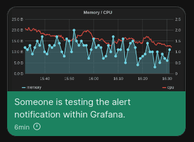

# Alertmanager Webhook Signal

This project creates a containerized http endpoint which listens for requests by an [alertmanager webhook receiver](https://prometheus.io/docs/alerting/latest/configuration/#webhook_config)
and maps it to the [signal-cli by bbernhard](https://github.com/bbernhard/signal-cli-rest-api).

This is useful if you already have the signal-cli running for example as a [home-assistant notifier](https://www.home-assistant.io/integrations/signal_messenger/).

Use a prometheus label `recipients` to specify where you want the signal message to be send.

It now supports alert webhooks from Grafana aswell, including a preview graph image!




## Run container

```bash
docker run -d --rm --name alertmanager-signal \
  -p 10000:10000 \
  -v $(pwd)/config.yaml:/config.yaml \
  docker.io/schlauerlauer/alertmanager-webhook-signal:1.0.1
```

## Configuration

A `config.yaml` file is needed for configuration.

Example configuration:

```yaml
# Alertmanager webhook url: /api/v3/alertmanager
# Grafana webhook url: /api/v3/grafana
server:
  port: 10000 # port this program listens on; required
  debug: false
signal:
  number: "+4923456" # the number you are sending messages from; required
  recipients: # default recipient(s), if the recipients label is not set in alert; required
  - "+49123123123"
  send: http://127.0.0.1:10001/v2/send # http endpoint of the signal-cli; required
alertmanager:
  ignoreLabels: # filter labels in the message; optional
  - "alertname"
  ignoreAnnotations: [] # filter annotations in the message; optional
  generatorURL: true # include generator URL in the message; optional (default: false)
  matchLabel: "recipients"
recipients: # optional list of recipient names and numbers for label matching
  alice: "+49123123123"
  bob: "+49234234234"
```

Example Alertmanager config.yml:

```yaml
global:

route:
  receiver: "signal"
  group_by: ["alertname"]
  group_wait: "5s"
  group_interval: "5m"
  repeat_interval: "3h"
receivers:
  - name: "signal"
    webhook_configs:
      - url: "http://10.88.0.1:10000/api/v3/alertmanager"
        send_resolved: true
```
